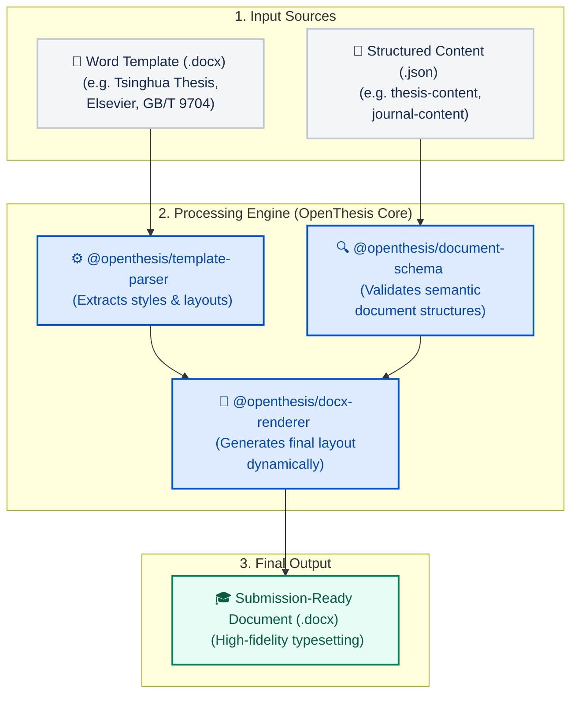

<p align="center">
  
</p>

<p align="center">
  <strong>AI-powered Document Template Engine</strong>
</p>

<p align="center">
  <a href="LICENSE"></a>
  
  
  
</p>

---

**One engine, infinite templates.** Parse any `.docx` template. Write in structured JSON. Export submission-ready DOCX.

For **university theses**, **journal articles**, and **government official documents** — with correct fonts, margins, headers, page numbers, table formatting, and equation rendering.

---

## Why?

| Existing tools                          | OpenThesis                                                              |
| --------------------------------------- | ----------------------------------------------------------------------- |
| Template **filling** (docxtemplater)    | Template **understanding** — knows what a heading, abstract, or 发文字号 IS |
| One template format hardcoded           | Parse **any** `.docx` template → JSON style DSL                         |
| Formatting parameters scattered in code | All formatting driven by the parsed template                            |
| Markdown → LaTeX (pandoc/ThesisForge)   | Markdown → **DOCX** (what 95% of Chinese universities require)          |
| Single document type                    | **Thesis + Journal + 公文** — one engine, three domains                   |

## What it does



## Quick Start

```bash
# 1. Install & build
git clone https://github.com/openthesis/openthesis.git
cd openthesis
pnpm install && pnpm build

# 2. Parse your university/favorite journal's .docx template
node packages/cli/dist/index.js parse 你的学校模板.docx --type thesis --org "XX大学"

# 3. Create sample content
node packages/cli/dist/index.js init --type thesis

# 4. Build your document
node packages/cli/dist/index.js build thesis-content.json -t template.json -o output.docx
```

## Three Document Types, One Engine

| `--type`   | Use Case           | Key Features                                                                       |
| ---------- | ------------------ | ---------------------------------------------------------------------------------- |
| `thesis`   | 学士/硕士/博士论文         | Cover page, abstract CN/EN, chapters, TOC, references, declaration, appendices     |
| `journal`  | 学术期刊投稿             | Authors + affiliations, corresponding author, funding, IMRaD structure, references |
| `official` | 党政机关公文 (GB/T 9704) | Red header, 发文字号, 签发人, 主送/抄送, 附件, signature block                                  |

### 公文示例 (Official Document)

```json
{
  "body_blocks": [
    { "type": "red_header", "text": "XX省人民政府文件", "font_size_pt": 22 },
    { "type": "document_number", "text": "X政发〔2026〕1号" },
    { "type": "centered_text", "text": "关于做好2026年防汛工作的通知", "font_size_pt": 18, "bold": true },
    { "type": "recipient_line", "text": "各市、州人民政府：", "recipientType": "primary" },
    { "type": "paragraph", "text": "为切实做好2026年防汛工作..." },
    { "type": "signature_block", "authority": "XX省人民政府", "date": "2026年6月13日" }
  ]
}
```

## Packages

| Package                       | npm | Description                                                |
| ----------------------------- | --- | ---------------------------------------------------------- |
| `@openthesis/document-schema` | —   | Domain models for thesis, journal, official documents      |
| `@openthesis/template-parser` | —   | Parse `.docx` → JSON style DSL with inheritance resolution |
| `@openthesis/docx-renderer`   | —   | Template-driven DOCX renderer (dolanmiu/docx)              |
| `@openthesis/equation-engine` | —   | LaTeX → plain text (V1) / OMML (V3)                        |
| `@openthesis/cli`             | —   | `thesis parse                                              |

## Features

- ✅ **Style inheritance resolution** — DOCX `basedOn` chains are recursively resolved
- ✅ **Semantic role detection** — Heuristically maps style names → block types (e.g. "标题 1" → heading1)
- ✅ **Page geometry extraction** — Margins, page size, columns from section properties
- ✅ **Complete table formatting** — Gridlines, header shading, column widths
- ✅ **Chinese + Western font separation** — 中文宋体/黑体 + English Times New Roman
- ✅ **Header/footer/page numbers** — With template-configurable text
- ✅ **Legacy format support** — Backward compatible with existing `{cover_blocks, body_blocks}` JSON
- 🚧 OMML equation rendering (V3)
- 🚧 Image embedding (V2)
- 🚧 Markdown → JSON parser (V2)

## Tech Stack

- **TypeScript** — strict mode, ESM
- **pnpm workspace** — monorepo
- **dolanmiu/docx** — DOCX generation
- **JSZip** + **fast-xml-parser** — DOCX template parsing
- **Node.js ≥ 18**

## How Template Parsing Works

A `.docx` file is a ZIP archive containing XML files. The key ones:

```
word/styles.xml      → Style definitions (fonts, sizes, spacing, alignment)
word/document.xml    → Page geometry (margins, size, columns)
```

The template parser:

1. **Unzips** the `.docx` with JSZip
2. **Parses** `styles.xml` to extract every paragraph and character style
3. **Resolves inheritance** — if "Heading 1" is `basedOn="Normal"`, all Normal's properties are merged in
4. **Extracts page settings** from `document.xml` section properties
5. **Detects semantic roles** — regex matching on style names + outline level fallback
6. **Outputs** a clean JSON DSL

This is the **key differentiator** vs docxtemplater/dolanmiu-docx: those tools fill templates with data, but OpenThesis **understands** the template's formatting logic.

## Roadmap

| Phase | Goal                                            | Status     |
| ----- | ----------------------------------------------- | ---------- |
| V1    | Core engine: parse + render + CLI               | ✅ Done     |
| V2    | Image embedding, Markdown parser, double-column | 🚧 Planned |
| V3    | LaTeX → OMML equation engine                    | 🚧 Planned |
| V4    | ML-based template layout understanding          | 📋 Future  |
| V5    | AI Agent: auto-generate thesis content          | 📋 Future  |
| SaaS  | Template marketplace (community-contributed)    | 📋 Future  |

## Contributing

This is an early-stage project. If you have a university/journal `.docx` template you'd like to add support for, please open an issue with the template attached (or a link to it).

PRs welcome. See [CLAUDE.md](CLAUDE.md) for architecture details.

## License

MIT © 2026 OpenThesis
