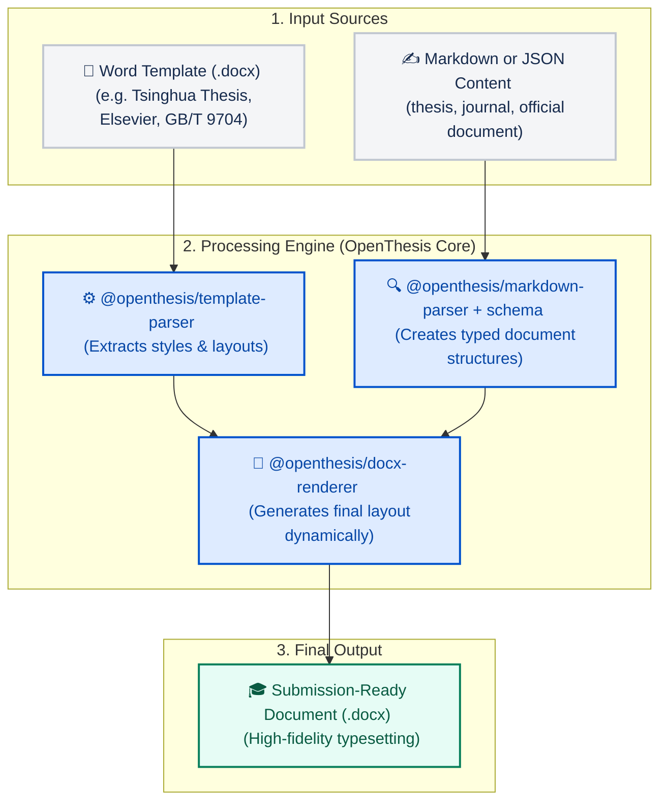

<p align="center">
  
</p>

<h1 align="center">OpenThesis</h1>

<p align="center">
  <strong>AI-powered Document Template Engine</strong>
</p>

<p align="center">
  <a href="README.md"></a>
  <a href="README.zh-CN.md"></a>
</p>

<p align="center">
  <a href="https://github.com/Gluxggg/OpenThesis/actions/workflows/ci.yml"></a>
  <a href="LICENSE"></a>
  
  
  
</p>

---

**One engine, infinite templates.** Parse any `.docx` template. Write in Markdown or structured JSON. Export submission-ready DOCX.

For **university theses**, **journal articles**, and **government official documents** — with correct fonts, margins, headers, page numbers, table formatting, and equation rendering.

---

## Why?

| Existing tools                          | OpenThesis                                                              |
| --------------------------------------- | ----------------------------------------------------------------------- |
| Template **filling** (docxtemplater)    | Template **understanding** — knows what a heading, abstract, or 发文字号 IS |
| One template format hardcoded           | Parse **any** `.docx` template → JSON style DSL                         |
| Formatting parameters scattered in code | All formatting driven by the parsed template                            |
| Markdown → LaTeX (pandoc/ThesisForge)   | Markdown or structured JSON → editable **DOCX**                         |
| Single document type                    | **Thesis + Journal + 公文** — one engine, three domains                   |

## What it does


```mermaid
graph TD
    %% Nodes and Groups
    subgraph Inputs ["1. Input Sources"]
        A["📄 Word Template (.docx) <br> (e.g. Tsinghua Thesis, Elsevier, GB/T 9704)"]
        B["✍️ Markdown or JSON Content <br> (thesis, journal, official document)"]
    end

    subgraph Core ["2. Processing Engine (OpenThesis Core)"]
        C["⚙️ @openthesis/template-parser <br> (Extracts styles & layouts)"]
        D["🔍 @openthesis/markdown-parser + schema <br> (Creates typed document structures)"]
        E["🎨 @openthesis/docx-renderer <br> (Generates final layout dynamically)"]
    end

    subgraph Output ["3. Final Output"]
        F["🎓 Submission-Ready Document (.docx) <br> (High-fidelity typesetting)"]
    end

    %% Flows
    A --> C
    B --> D
    C --> E
    D --> E
    E --> F

    %% Styling
    classDef inputStyle fill:#f4f5f7,stroke:#c1c7d0,stroke-width:2px,color:#172b4d;
    classDef coreStyle fill:#deebff,stroke:#0052cc,stroke-width:2px,color:#0747a6;
    classDef outputStyle fill:#e6fcf5,stroke:#087f5b,stroke-width:2px,color:#095b42;

    class A,B inputStyle;
    class C,D,E coreStyle;
    class F outputStyle;
```

## Quick Start

```bash
# 1. Install & build
git clone https://github.com/Gluxggg/OpenThesis.git
cd OpenThesis
pnpm install && pnpm build

# 2. Build the included Markdown example directly
node packages/cli/dist/index.js build examples/sample-thesis.md -o output.docx

# 3. Or parse your university/favorite journal's .docx template
node packages/cli/dist/index.js parse 你的学校模板.docx --type thesis --org "XX大学"

# 4. Create sample structured content
node packages/cli/dist/index.js init --type thesis

# 5. Build with the parsed template
node packages/cli/dist/index.js build thesis-content.json -t template.json -o output.docx
```

Markdown can also be exported as inspectable JSON:

```bash
node packages/cli/dist/index.js import manuscript.md --type thesis -o manuscript.json
```

## Agent Skill

OpenThesis ships as a standard repository skill at `.codex/skills/openthesis`. Agents can invoke it explicitly with `$openthesis`, or discover it automatically for thesis, journal, official-document, Word-template, and Markdown-to-DOCX tasks.

The skill includes a stable wrapper, focused workflow references, the Markdown contract, the content-schema quick reference, and UI metadata:

```bash
node .codex/skills/openthesis/scripts/openthesis.mjs build manuscript.md \
  --type thesis -t university.template.json -o final.docx
```

## Three Document Types, One Engine

| `--type`   | Use Case           | Key Features                                                                       |
| ---------- | ------------------ | ---------------------------------------------------------------------------------- |
| `thesis`   | 学士/硕士/博士论文         | Structured cover, nested chapters, figures, tables, equations, references |
| `journal`  | 学术期刊投稿             | Authors, affiliations, abstract, keywords, nested sections, references    |
| `official` | 党政机关公文 (GB/T 9704) | Red header, 发文字号, 主送/抄送、附件和落款                                  |

### 公文示例 (Official Document)

```json
{
  "type": "official",
  "meta": {
    "title": "关于做好2026年防汛工作的通知",
    "issuingAuthority": "XX省人民政府",
    "documentNumber": "X政发〔2026〕1号",
    "documentCategory": "通知",
    "primaryRecipients": ["各市、州人民政府"],
    "date": "2026年6月13日"
  },
  "body": [
    { "type": "paragraph", "text": "为切实做好2026年防汛工作……" }
  ]
}
```

## Packages

| Package                       | npm | Description                                                |
| ----------------------------- | --- | ---------------------------------------------------------- |
| `@openthesis/document-schema` | —   | Domain models for thesis, journal, official documents      |
| `@openthesis/markdown-parser` | —   | Markdown + front matter → typed document JSON              |
| `@openthesis/template-parser` | —   | Parse `.docx` → JSON style DSL with inheritance resolution |
| `@openthesis/docx-renderer`   | —   | Template-driven DOCX renderer (dolanmiu/docx)              |
| `@openthesis/equation-engine` | —   | LaTeX math AST + Unicode/Pandoc compatibility fallbacks    |
| `@openthesis/cli`             | —   | CLI: `thesis parse`, `import`, `init`, and `build`          |

## Features

- ✅ **Style inheritance resolution** — DOCX `basedOn` chains are recursively resolved
- ✅ **Template-silent vs. explicit formatting** — A style declares only what the template actually specifies; the renderer fills the rest from domain defaults (学位论文 vs. GB/T 9704 公文), so a formatting-free template still produces correct headings
- ✅ **Semantic role detection** — Heuristically maps style names → block types (e.g. "标题 1" → heading1), restricted to paragraph styles and anchored so `Table Grid` is not mistaken for a heading
- ✅ **Page geometry extraction** — Margins, page size, columns from every section, including paragraph-level section breaks
- ✅ **Template diagnostics** — `parse` reports a template that carries no formatting, inherits from undefined styles, or declares more sections than can be rendered
- ✅ **Content validation** — `build` checks content against the schema and reports every problem at once with a path
- ✅ **Template-fitted tables** — Width follows the printable page area; cell, header, and caption typography resolve through the template
- ✅ **Chinese + Western font separation** — 中文宋体/黑体 + English Times New Roman
- ✅ **Header/footer/page numbers** — With template-configurable text
- ✅ **Image embedding** — PNG/JPEG/GIF/BMP detection, aspect ratio, and captions
- ✅ **Real Word lists** — Auto-numbered bullets and numbering via OOXML, with each list restarting its own counter
- ✅ **Lists, code blocks, and blockquotes** — Native paragraph rendering with borders and indents
- ✅ **Markdown import** — Front matter (scalars, flow sequences, block sequences), nested sections, lists, tables, figures, code, quotes, and display equations
- ✅ **Direct Markdown builds** — `.md` → `.docx` without an intermediate file
- ✅ **Agent-ready Skill** — Standard `SKILL.md`, executable wrapper, UI metadata, and progressive references
- ✅ **Native Office Math core** — Fractions, roots, scripts, sums, integrals, symbols, and Greek letters emit OMML
- ✅ **Advanced native math slice** — Functions, limits, accents, scalable delimiters, binomials, matrices, cases, and aligned equations
- ✅ **Conversion diagnostics** — `convertLatexToOmml` reports whether the result is native OMML or a lossy Unicode fallback, and why
- ✅ **Legacy format support** — Backward compatible with existing `{cover_blocks, body_blocks}` JSON
- 🚧 **Remaining V3 coverage** — User-defined macros, array column specifications, equation arrays, and less common AMS environments

## Tech Stack

- **TypeScript** — strict mode, ESM
- **pnpm workspace** — monorepo
- **dolanmiu/docx** — DOCX generation
- **JSZip** + **fast-xml-parser** — DOCX template parsing
- **Node.js ≥ 22**

## How Template Parsing Works

A `.docx` file is a ZIP archive containing XML files. The key ones:

```
word/styles.xml      → Style definitions (fonts, sizes, spacing, alignment)
word/document.xml    → Page geometry (margins, size, columns)
```

The template parser:

1. **Unzips** the `.docx` with JSZip
2. **Parses** `styles.xml` to extract every paragraph and character style
3. **Resolves inheritance** — if "Heading 1" is `basedOn="Normal"`, all Normal's properties are merged in
4. **Extracts page settings** from `document.xml` section properties
5. **Detects semantic roles** — regex matching on style names + outline level fallback
6. **Outputs** a clean JSON DSL

This is the **key differentiator** vs docxtemplater/dolanmiu-docx: those tools fill templates with data, but OpenThesis **understands** the template's formatting logic.

## Roadmap

| Phase | Goal                                            | Status     |
| ----- | ----------------------------------------------- | ---------- |
| V1    | Core engine: parse + render + CLI               | ✅ Done     |
| V2    | Images + double-column output; Markdown parser  | ✅ Done     |
| V3    | Native LaTeX → OMML insertion                   | 🚧 In progress (core + advanced common subset) |
| V4    | ML-based template layout understanding          | 📋 Future  |

## Star History
<a href="https://www.star-history.com/?repos=Gluxggg%2FOpenThesis&type=date&legend=bottom-right">
 <picture>
   <source media="(prefers-color-scheme: dark)" srcset="https://api.star-history.com/chart?repos=Gluxggg/OpenThesis&type=date&theme=dark&legend=bottom-right&sealed_token=Ox0FRvFHuhL8XFkGZbRaltIW5xOjjr_FINCudPFW-xjxqtcdJ_C4uhwl7uJoBnKHDbgp2CjIUf5jm4NNLaWDtkbfOaGxInn4g7cNbI3HFUn4PikQgcg6gNugDaR_ZXiO3V_WSljteiv1MAkRynoTldkIJGZ_kPEZhw3CNRjnc9F0rF3HBlOM3p-dviJ_" />
   <source media="(prefers-color-scheme: light)" srcset="https://api.star-history.com/chart?repos=Gluxggg/OpenThesis&type=date&legend=bottom-right&sealed_token=Ox0FRvFHuhL8XFkGZbRaltIW5xOjjr_FINCudPFW-xjxqtcdJ_C4uhwl7uJoBnKHDbgp2CjIUf5jm4NNLaWDtkbfOaGxInn4g7cNbI3HFUn4PikQgcg6gNugDaR_ZXiO3V_WSljteiv1MAkRynoTldkIJGZ_kPEZhw3CNRjnc9F0rF3HBlOM3p-dviJ_" />
   
 </picture>
</a>

## Contributing

Contributions are welcome! Please open an issue to report bugs or propose new features. For code changes, submit a focused pull request with a clear description and relevant tests.

Before submitting a pull request, run:

```bash
pnpm check
pnpm audit --prod
```

## Development checks

```bash
pnpm check          # strict TypeScript build + automated tests
pnpm audit --prod   # production dependency security audit
```

## License

MIT © 2026 OpenThesis
