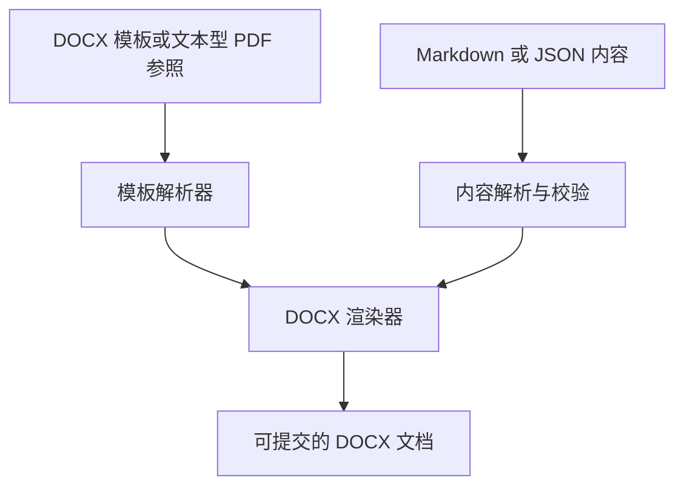

<p align="center">
  
</p>

<h1 align="center">OpenThesis</h1>

<p align="center">
  <strong>AI 驱动的文档模板引擎</strong>
</p>

<p align="center">
  <a href="README.md"></a>
  <a href="README.zh-CN.md"></a>
</p>

<p align="center">
  <a href="https://github.com/1771902720-lgtm/OpenThesis/actions/workflows/ci.yml"></a>
  <a href="LICENSE"></a>
  
  
  
</p>

---

**一个引擎，无限模板。** 解析 `.docx` 模板，或从文本型 `.pdf` 参照文件中推断可复用样式；使用 Markdown 或结构化 JSON 写作，导出可直接提交且可继续编辑的 DOCX。

适用于**高校学位论文**、**期刊论文**和**党政机关公文**，可处理字体、页边距、页眉页脚、页码、表格和公式等排版要求。

---

## 为什么选择 OpenThesis？

| 传统方案 | OpenThesis |
| --- | --- |
| 只向模板中填充数据 | 理解标题、摘要、发文字号等语义角色 |
| 针对单个模板硬编码 | 解析 DOCX 或推断文本型 PDF 布局并生成 JSON 样式 DSL |
| 格式参数散落在代码中 | 所有格式由解析后的模板驱动 |
| Markdown 通常导出 LaTeX | Markdown 或 JSON 直接生成可编辑 DOCX |
| 仅支持单一文档类型 | 一个引擎覆盖论文、期刊和公文 |

## 工作流程



## PDF 模板支持

许多高校、期刊和政府部门只发布 PDF 格式的排版规范或示例文件。OpenThesis 现在可以直接解析**文本型 PDF**，推断出驱动 DOCX 输出的 OpenThesis 模板。

| 输入 | 当前支持情况 | 说明 |
| --- | --- | --- |
| `.docx` 模板 | ✅ 原生支持 | 可提取命名样式、继承关系、页面尺寸、页眉页脚和分栏设置 |
| 文本型 `.pdf` | ✅ 启发式推断 | 推断页面尺寸、页边距、分栏、字体、字号、对齐、行距和语义角色 |
| 扫描型 `.pdf` | ⚠️ 需要 OCR | PDF 没有可提取文字时会返回明确的 OCR 提示 |
| Markdown / OpenThesis JSON | ✅ 原生支持 | 作为文档内容输入，并渲染为可编辑 DOCX |

```bash
node packages/cli/dist/index.js parse 格式说明.pdf \
  --type thesis --org "XX大学"
# → 格式说明.template.json
```

PDF 保存的是定位后的字符，而不是 Word 的命名样式。OpenThesis 会把文字组合成行，聚类字体和字号，识别主要正文样式，并把较大或居中的样式映射为标题。生成的 JSON 会保留警告，因为 PDF 中没有记录的信息无法被凭空恢复。

正式使用前应检查生成的模板。精确表格边框、绘图对象、页眉页脚、脚注和扫描页面暂不在第一版 PDF 支持范围内；高级重建和内置 OCR 计划在 V4 实现。

## 快速开始

```bash
# 1. 安装并构建
git clone https://github.com/1771902720-lgtm/OpenThesis.git
cd OpenThesis
pnpm install && pnpm build

# 2. 直接构建仓库内的 Markdown 示例
node packages/cli/dist/index.js build examples/sample-thesis.md -o output.docx

# 3. 解析 DOCX 模板或文本型 PDF 参照
node packages/cli/dist/index.js parse 你的学校模板.docx --type thesis --org "XX大学"
node packages/cli/dist/index.js parse 期刊格式说明.pdf --type journal --org "期刊名称"

# 4. 创建结构化内容示例
node packages/cli/dist/index.js init --type thesis

# 5. 使用解析后的模板生成文档
node packages/cli/dist/index.js build thesis-content.json -t template.json -o output.docx
```

Markdown 也可以先导出为便于检查的 JSON：

```bash
node packages/cli/dist/index.js import manuscript.md --type thesis -o manuscript.json
```

## Agent Skill

OpenThesis 在 `.codex/skills/openthesis` 中提供标准仓库 Skill。Agent 可以通过 `$openthesis` 显式调用，也可以在论文、期刊、公文、Word/PDF 模板和 Markdown 转 DOCX 等任务中自动发现它。

```bash
node .codex/skills/openthesis/scripts/openthesis.mjs build manuscript.md \
  --type thesis -t university.template.json -o final.docx
```

## 支持的文档类型

| `--type` | 使用场景 | 主要能力 |
| --- | --- | --- |
| `thesis` | 学士、硕士、博士论文 | 封面、章节、图表、公式和参考文献 |
| `journal` | 学术期刊投稿 | 作者、单位、摘要、关键词、章节和参考文献 |
| `official` | 党政机关公文（GB/T 9704） | 红头、发文字号、主送/抄送、附件和落款 |

## 核心包

| 包 | 功能 |
| --- | --- |
| `@openthesis/document-schema` | 论文、期刊和公文的领域模型 |
| `@openthesis/markdown-parser` | Markdown 与 front matter 转结构化文档 JSON |
| `@openthesis/template-parser` | 解析 DOCX 或推断文本型 PDF 布局，生成 JSON 样式 DSL |
| `@openthesis/docx-renderer` | 模板驱动的 DOCX 渲染器 |
| `@openthesis/equation-engine` | LaTeX 数学 AST、原生 OMML 与兼容回退 |
| `@openthesis/cli` | `parse`、`import`、`init` 和 `build` 命令行工具 |

## 主要能力

- ✅ 解析并递归合并 DOCX 样式继承关系
- ✅ 将文本型 PDF 的字体和页面几何信息推断为可复用模板
- ✅ 根据样式名称和大纲级别识别标题、摘要等语义角色
- ✅ 提取页面尺寸、页边距和分栏设置
- ✅ 表格边框、底纹和列宽控制
- ✅ 中文与西文字体分别配置
- ✅ 页眉、页脚和页码
- ✅ 图片嵌入、尺寸处理和题注
- ✅ 列表、代码块和引用块
- ✅ Markdown 导入与直接构建 DOCX
- ✅ 标准 Agent Skill
- ✅ 分数、根式、上下标、求和、积分、符号和希腊字母的原生 Office Math
- ✅ 函数、极限、重音、可缩放括号、二项式、矩阵、分段函数和对齐公式
- 🚧 后续 V3：用户宏、数组列规格、公式数组和较少使用的 AMS 环境

## 技术栈

- TypeScript 严格模式与 ESM
- pnpm workspace 单体仓库
- dolanmiu/docx
- JSZip 与 fast-xml-parser
- PDF.js
- Node.js ≥ 22

## 路线图

| 阶段 | 目标 | 状态 |
| --- | --- | --- |
| V1 | 核心解析、渲染与 CLI | ✅ 完成 |
| V2 | 图片、双栏输出与 Markdown 解析器 | ✅ 完成 |
| V3 | 原生 LaTeX → OMML | 🚧 进行中（核心与常用高级子集） |
| V4 | 高级 PDF 重建：OCR、表格、页眉页脚和机器学习语义识别 | 📋 未来计划 |
| V5 | 自动生成论文内容的 AI Agent | 📋 未来计划 |
| SaaS | 社区贡献的模板市场 | 📋 未来计划 |

## Star History

<p align="center">
  <a href="https://www.star-history.com/#1771902720-lgtm/OpenThesis&Date">
    
  </a>
</p>

## 参与贡献

如果你希望 OpenThesis 支持某个高校或期刊的 `.docx` 或文本型 `.pdf` 模板，欢迎提交 issue 并附上模板或下载链接。

欢迎提交 PR。开发流程参见 [CONTRIBUTING.md](CONTRIBUTING.md)，架构说明参见 [CLAUDE.md](CLAUDE.md)。

## 开发检查

```bash
pnpm check
pnpm audit --prod
```

## 许可证

MIT © 2026 OpenThesis
