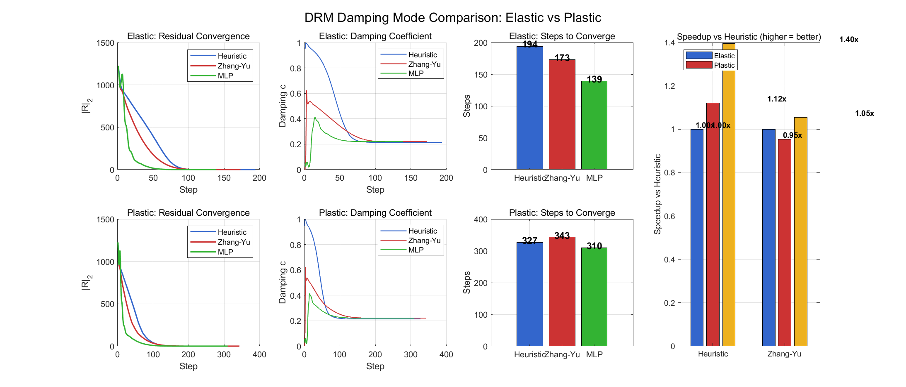

# 基于开放模板的智能文档生成研究

## 第一章 绪论

OpenThesis 将内容结构与排版模板分离，使同一份内容可以应用不同院校或期刊的格式规范。

### 研究目标

- 解析任意 DOCX 模板的样式与页面结构
- 将 Markdown 转换为类型安全的文档结构
- 输出可直接编辑的 DOCX 文件

## 第二章 系统设计

核心处理流程如图所示。

### 数据模型

| 模块 | 输入 | 输出 |
| --- | --- | --- |
| Template Parser | DOCX | 样式 JSON |
| Markdown Parser | Markdown | 内容 JSON |
| DOCX Renderer | 内容与模板 | DOCX |

### 公式处理

系统支持 LaTeX 风格的块级公式：

$$E = mc^2$$

## 第三章 结论

实验表明，模板驱动方法能够提高文档生成流程的复用性与可维护性。
